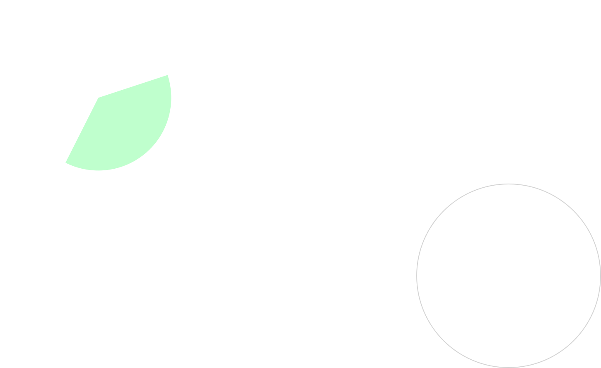
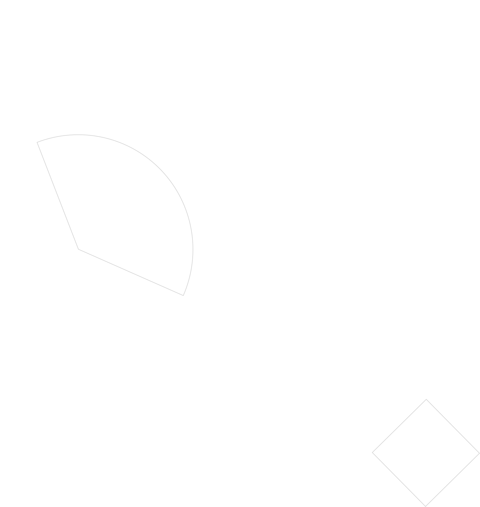
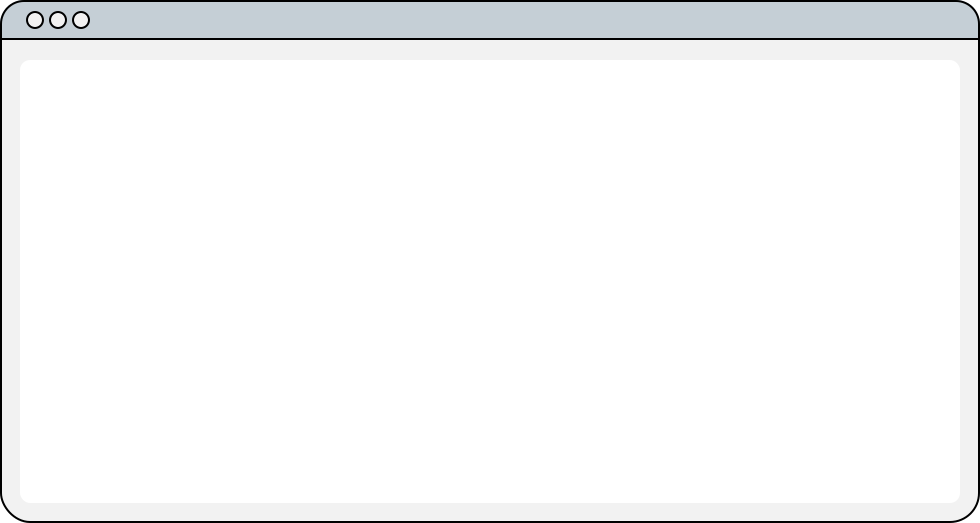
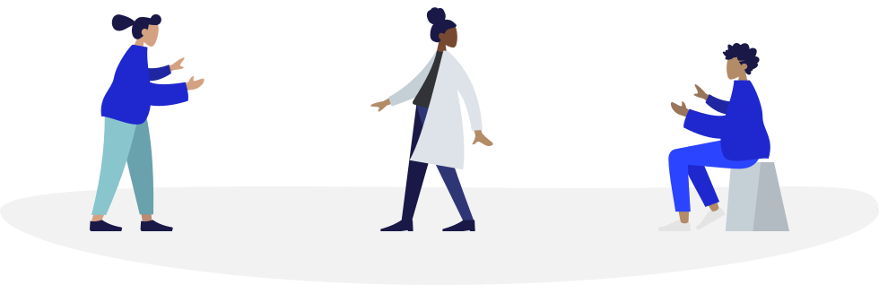

<!-- Hero -->
<section class="relative p-12">
    
    

        

            <h1>Open Work  Definition</h1>
            
Subtitle will be place here with 36 pt  regular weight.

            <button class="mt-6 mb-12">Request Edit</button>
            
This project is maintained by Open@RIT Hoston on GitHub Pages

        

    

</section>

<!-- Goal of Open Work -->
<section class="relative p-12 lg:grid grid-cols-2 justify-center inner--small gap-12">
    
    

        <h2 class="sm:whitespace-nowrap">Why Are We Using The Term  <b>Open Work</b>?</h2>
        
Goal of Open Work

        

        
People produce and collaborate on all different types of work within academia and beyond. Different types of
            works can be released and developed among communities of practice in different ways.
              
            To treat each type of Open Work as its own silo hinders the ability for these works to be used
            interchangeably among each other.
              
            We use the term Open Work to talk about a larger theory of practice in which Works of all types are
            developed, distributed, and collaborated upon.
        

    

    
</section>

<!-- Definition of Open Work -->
<section class="relative p-12">
    
    <h2 class="text-center mb-20"><b>Open Work</b> Definition Version 0.1</h2>
    

        
        
    

    <!-- accordions from tw-elements library -->
    

        

            <h2 class="accordion-header mb-0" id="headingOne">
                <button class="accordion-button accordion-button--gray collapsed h-[4.4rem]" type="button"
                    data-bs-toggle="collapse" data-bs-target="#collapseOne" aria-expanded="false"
                    aria-controls="collapseOne">
                    
                    Definition of Work
                </button>
            </h2>
            

                

                    A <b>Work</b> is any piece of copyrightable material. This could be software, writing, music, and
                    many other things.
                      
                    <a href="">See below</a> for common types of Open Works.
                

            

        

        

            <h2 class="accordion-header mb-0" id="headingTwo">
                <button class="accordion-button accordion-button--gray collapsed" type="button"
                    data-bs-toggle="collapse" data-bs-target="#collapseTwo" aria-expanded="false"
                    aria-controls="collapseTwo">
                    
                    Definition of License
                </button>
            </h2>
            

                

                    A <b>License</b>, in this context, is a document describing the terms and conditions that one is
                    allowed to use a <b>Work</b>.
                      
                    A <b>License</b> is necessary for any <b>Work</b> to be considered
                    <b>Open</b> unless that work is <b>Public Domain</b>.

                

            

        

        

            <h2 class="accordion-header mb-0" id="headingThree">
                <button class="accordion-button accordion-button--gray collapsed" type="button"
                    data-bs-toggle="collapse" data-bs-target="#collapseThree" aria-expanded="false"
                    aria-controls="collapseThree">
                    
                    Definition of Open
                </button>
            </h2>
            

                

                    As with most definitions of Open, our definition specifically focuses on the licensing and
                    redistribution of a Work. That work must be available and licensed so anyone can view it,
                    redistribute it, and modify it openly, in compliance with whatever license has been applied to it.
                      
                    For more details on the exact definition of Open - See the <a
                        href="http://opendefinition.org/od/2.1/en/">OKF's definition of “Open.”</a>
                

            

        

        

            <h2 class="accordion-header mb-0" id="headingFour">
                <button class="accordion-button accordion-button--gray collapsed" type="button"
                    data-bs-toggle="collapse" data-bs-target="#collapseFour" aria-expanded="false"
                    aria-controls="collapseFour">
                    
                    Definition of Public Domain
                </button>
            </h2>
            

                

                    When a <b>Work</b> has no copyright, it is available to the public. This means that no individual
                    has
                    any ownership over that work. A <b>Public Domain Work</b> cannot be <b>Licensed</b> as there is no
                    copyright holder.
                      
                    <b>A Public Domain Work</b> is considered one form of an <b>Open Work</b>.
                

            

        

    

    <!-- Definition of... cards -->
    

        

            

                
<b>Definition of Work</b>

                
A <b>Work</b> is any piece of copyrightable material. This could be software, writing, music, and
                    many other things.
                      
                    <a href="">See below</a> for common types of Open Works.
                

                
                <!-- card icon -->
            

        

        

            

                
<b>Definition of License</b>

                
A <b>License</b>, in this context, is a document describing the terms and conditions that one is
                    allowed to use a <b>Work</b>.
                      
                    A <b>License</b> is necessary for any <b>Work</b> to be considered
                    <b>Open</b> unless that work is <b>Public Domain</b>.
                

                
                <!-- card icon -->
            

        

    

    

        

            

                
<b>Definition of Open</b>

                
As with most definitions of Open, our definition specifically focuses on the licensing and
                    redistribution of a Work. That work must be available and licensed so anyone can view it,
                    redistribute it, and modify it openly, in compliance with whatever license has been applied to it.
                      
                    For more details on the exact definition of Open - See the <a
                        href="http://opendefinition.org/od/2.1/en/">OKF's definition of “Open.”</a>
                

                
                <!-- card icon -->
            

        

        

            

                
<b>Definition of Public Domain</b>

                
When a <b>Work</b> has no copyright, it is available to the public. This means that no individual has
                    any ownership over that work. A <b>Public Domain Work</b> cannot be <b>Licensed</b> as there is no
                    copyright holder.
                      
                    <b>A Public Domain Work</b> is considered one form of an <b>Open Work</b>.
                

                
                <!-- card icon -->
            

        

    

</section>

<!-- The Roots of Open Work -->
<section class="relative p-12">
    
    <h2 class="text-center">The <b>Roots</b> of "Open Work"</h2>
    
The intellectual “Family Tree” of the term Open Work includes examples
        from
        technology, science, and the arts.

    

        

            
Technology

            

            
<a href="http://criticalartware.net/DistributionReligion/DistributionReligion.pdf">Distribution
                    Religion</a>: Arguably the first “Open Hardware” license, from the manual/instructions for the
                <a href="https://en.wikipedia.org/wiki/Sandin_Image_Processor">Sandin Image Processor</a>) (1976-1978)
                  
                <a href="https://en.wikipedia.org/wiki/Li-Chen_Wang">CopyLeft: Li-Chen Wang</a>'s Palo Alto <a
                    href="https://en.wikipedia.org/wiki/Tiny_BASIC">Tiny BASIC</a> (1976)
                  
                <a href="https://www.fsf.org/">Free Software, the FSF and the GPL: Richard Stallman</a> et al beginning
                in 1984-Present
                  
                <a href="https://opensource.com/article/18/2/coining-term-open-source-software">Open Source</a>: The
                term coined by <a href="https://opensource.com/users/christine-peterson">Christine Peterson</a> and the
                creation of the <a href="https://opensource.org/history">Open Software Initiative</a>,
                1998
            

        

        

            
Literature and the Arts

            

            
Umberto Eco's “<a
                    href="https://www.researchgate.net/publication/280730233_Text_and_Meaning_in_Umberto_Eco's_The_Open_Work">The
                    Open Work</a>” is art with “two constituents: a multiplicity of meanings and the
                participation
                of the audience."
            

        

        

            
Science

            

            
The intellectual “Family Tree” of the term Open Work includes examples from technology, science, and the
                arts.
            

        

    

</section>

<section class="p-12 relative pb-20">
    
    <!-- Types of Open Work -->
    <!-- accordions from tw-elements library -->
    <h2 class="text-center mb-14">Types of <b>Open Work</b></h2>
    

        

            

                <h2 class="accordion-header mb-0" id="headingOne">
                    <button class="accordion-button accordion-button--gray collapsed h-[4.4rem]" type="button"
                        data-bs-toggle="collapse" data-bs-target="#collapseOne" aria-expanded="false"
                        aria-controls="collapseOne">
                        
                        Open Educational Resources
                    </button>
                </h2>
                

                    

                        OER are openly licensed educational materials — everything from a single lesson plan to an
                        entire
                        textbook — that are free to use, customize, and share.
                         
                         
                        <a href="https://www.oercommons.org/oer-101" rel="noopener noreferrer">OER
                            Commons</a>
                    

                

            

            

                <h2 class="accordion-header mb-0" id="headingTwo">
                    <button class="accordion-button accordion-button--gray collapsed" type="button"
                        data-bs-toggle="collapse" data-bs-target="#collapseTwo" aria-expanded="false"
                        aria-controls="collapseTwo">
                        
                        Open Innovation
                    </button>
                </h2>
                

                    

                        "A distributed innovation process based on purposively managed knowledge flows across
                        organizational
                        boundaries, using pecuniary and non-pecuniary mechanisms in line with the organization's
                        business
                        model". <a href="https://en.wikipedia.org/wiki/Open_innovation#cite_note-4">[4]</a> —
                        Henry Chesbrough
                         
                         
                        This more recent definition acknowledges that open innovation is not solely firm-centric: it
                        also
                        includes <a href="https://en.wikipedia.org/wiki/Creative_consumer"> creative consumers</a> <a
                            href="https://en.wikipedia.org/wiki/Open_innovation#cite_note-5">[5]</a> and
                        communities of user innovators. <a
                            href="https://en.wikipedia.org/wiki/Open_innovation#cite_note-6">[6]</a>
                         
                         
                        <a href="http://openinnovation.net/about-2/open-innovation-definition/"
                            rel="noopener noreferrer">Open Innovation Community</a>

                    

                

            

            

                <h2 class="accordion-header mb-0" id="headingThree">
                    <button class="accordion-button accordion-button--gray collapsed" type="button"
                        data-bs-toggle="collapse" data-bs-target="#collapseThree" aria-expanded="false"
                        aria-controls="collapseThree">
                        
                        Open Source Software
                    </button>
                </h2>
                

                    

                        Open source software is code that is designed to be publicly accessible—anyone can see, modify,
                        and
                        distribute the code as they see fit.
                         
                         
                        <a href="https://www.redhat.com/en/topics/open-source/what-is-open-source">Red Hat, Inc.
                        </a>
                    

                

            

            

                <h2 class="accordion-header mb-0" id="headingFour">
                    <button class="accordion-button accordion-button--gray collapsed" type="button"
                        data-bs-toggle="collapse" data-bs-target="#collapseFour" aria-expanded="false"
                        aria-controls="collapseFour">
                        
                        Open Scholarship
                    </button>
                </h2>
                

                    

                        Open Scholarship is defined by the Association of Research Libraries (ARL) as encompassing open
                        access, open data, open educational resources, and all other forms of openness in the scholarly
                        and
                        research environment, is changing how knowledge is created and shared.
                         
                         
                        <a href="https://guides.library.pdx.edu/c.php?g=931273&p=6711316">Portland State University
                            Library
                        </a>
                    

                

            

            

                <h2 class="accordion-header mb-0" id="headingFive">
                    <button class="accordion-button accordion-button--gray collapsed" type="button"
                        data-bs-toggle="collapse" data-bs-target="#collapseFive" aria-expanded="false"
                        aria-controls="collapseFive">
                        
                        Open Data/Open Knowledge
                    </button>
                </h2>
                

                    

                        A data set that is released freely for any to use and modify.
                         
                         
                        Open definition: <a href="https://opendefinition.org/">Open Knowledge Foundation </a>
                         
                         
                        Open knowledge: <a href="https://okfn.org/opendata/">Open Knowledge Foundation </a>
                    

                

            

        

        

            

                <h2 class="accordion-header mb-0" id="headingSix">
                    <button class="accordion-button accordion-button--gray collapsed" type="button"
                        data-bs-toggle="collapse" data-bs-target="#collapseSix" aria-expanded="false"
                        aria-controls="collapseSix">
                        
                        Open Hardware
                    </button>
                </h2>
                

                    

                        Open source hardware is hardware whose design is made publicly available so that anyone can
                        study,
                        modify, distribute, make, and sell the design or hardware based on that design.
                         
                         
                        <a href="https://www.oshwa.org/definition/">Open Source Hardware Association</a>
                    

                

            

            

                <h2 class="accordion-header mb-0" id="headingSeven">
                    <button class="accordion-button accordion-button--gray collapsed" type="button"
                        data-bs-toggle="collapse" data-bs-target="#collapseSeven" aria-expanded="false"
                        aria-controls="collapseSeven">
                        
                        Open Science
                    </button>
                </h2>
                

                    

                        Open science encompasses unhindered access to scientific articles, access to data from public
                        research, and collaborative research enabled by ICT tools and incentives.
                         
                         
                        Open definition: <a href="https://www.oecd.org/sti/inno/open-science.htm"> Organisation for
                            Economic Co-operation and Development</a>
                    

                

            

            

                <h2 class="accordion-header mb-0" id="headingEight">
                    <button class="accordion-button accordion-button--gray collapsed" type="button"
                        data-bs-toggle="collapse" data-bs-target="#collapseEight" aria-expanded="false"
                        aria-controls="collapseEight">
                        
                        Open Design
                    </button>
                </h2>
                

                    

                        Any piece of design work released freely for anyone to use or modify.
                         
                         
                        <a
                            href="https://github.com/OpenDesign-WorkingGroup/Open-Design-Definition/blob/master/open.design_definition/open.design.definition.md">Open
                            Design Working Group Definition</a>
                    

                

            

            

                <h2 class="accordion-header mb-0" id="headingNine">
                    <button class="accordion-button accordion-button--gray collapsed" type="button"
                        data-bs-toggle="collapse" data-bs-target="#collapseNine" aria-expanded="false"
                        aria-controls="collapseNine">
                        
                        Open Research
                    </button>
                </h2>
                

                    

                        Open research comprises openness throughout the research cycle through collaborative working and
                        sharing and making research methodology, software, code, and equipment freely available online,
                        along with instructions for using it.
                         
                         
                        Open research includes making publications freely available online (open access) in addition to
                        the underlying research data (open data).
                         
                         
                        <a href="http://www.exeter.ac.uk/research/openresearch/about/explained/">University of Exeter
                            (UK)
                        </a>
                    

                

            

            

                <h2 class="accordion-header mb-0" id="headingTen">
                    <button class="accordion-button accordion-button--gray collapsed" type="button"
                        data-bs-toggle="collapse" data-bs-target="#collapseTen" aria-expanded="false"
                        aria-controls="collapseTen">
                        
                        Open Access Journals
                    </button>
                </h2>
                

                    

                        Open Access is the free, immediate, online availability of research articles combined with the
                        rights to use these articles fully in the digital environment.
                         
                         
                        Open Access is the needed modern update for the communication of research that fully utilizes
                        the Internet for what it was originally built to do—accelerate research.  
                         
                         
                        <a href="https://sparcopen.org/open-access/">SPARC on Open Access Journals</a>
                    

                

            

        

    

</section>

<!-- Ending Note -->
<section class="relative">
    
    

        

            <h2><b>Note from  Open@RIT Team</b></h2>
            

            
Open Work Definition is an open source document for everyone who wants to contribute to the open work
                community.
                  
                Please don't hesitate to contact us, send a pull request, and share your thoughts.
            

            <button class="mt-8">Request Edit</button>
        

        
    

</section>